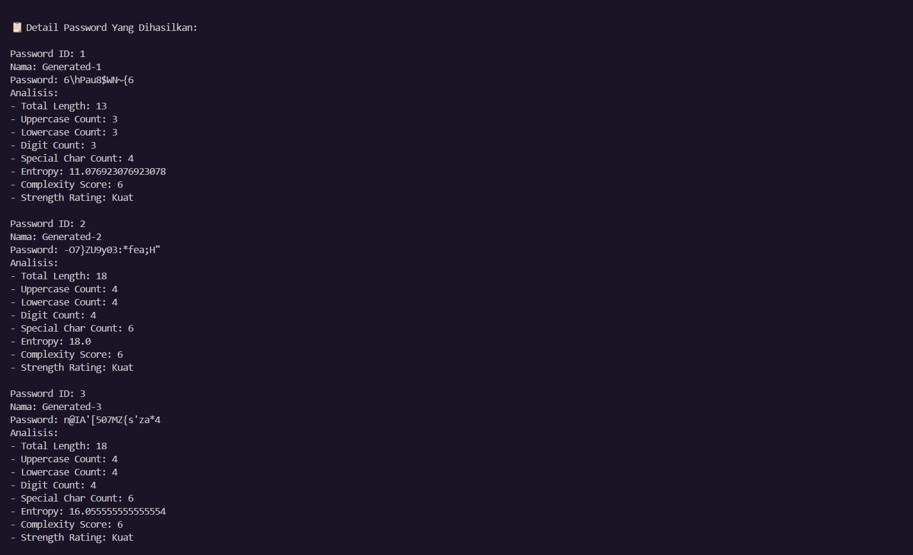
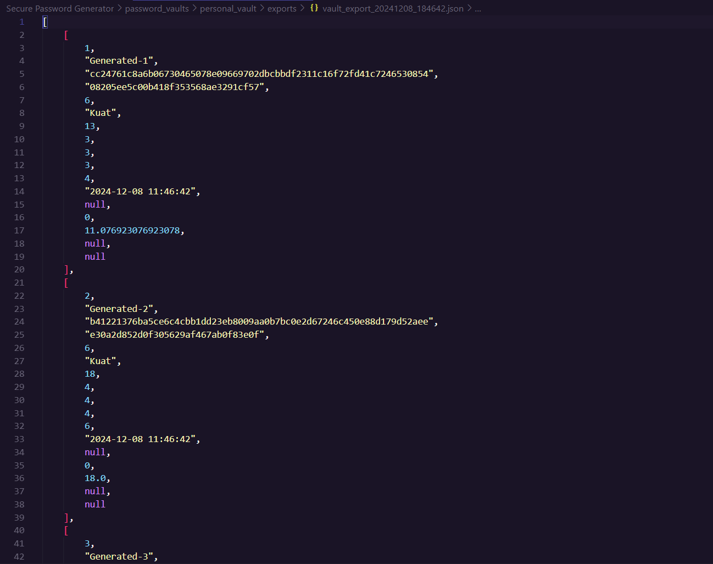
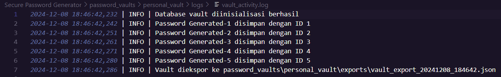

# 🔐 SecurePass Generator

## 🚀 Deskripsi Proyek
Sebuah alat untuk menghasilkan password kuat dan mengamankan data sensitif ksmu. Proyek ini memberikan solusi dalam pembuatan passwords dan pengamanan dengan teknologi enkripsi.

## ✨ Fitur Unggulan
- **Password Generator Cerdas**
  - Pembuatan password acak yang sangat aman
  - Kontrol penuh atas kompleksitas password
  - Algoritma pembuatan yang baik (tidak eror)

- **Metode Enkripsi Tingkat Lanjut**
  - Dukungan multiple algoritma hash
  - Konversi password ke format terenkripsi
  - Analisis kekuatan password
  - Perlindungan terhadap serangan brute force

# Review

# Database

# Database Vault



## 🛠 Teknologi
- Algoritma Enkripsi: 
  - SHA-256
  - BCrypt
  - PBKDF2
- Bahasa Pemrograman: Python

## 🔒 Keamanan
- Tidak menyimpan password mentah
- Enkripsi end-to-end
- Perlindungan data maksimal


# 🔐 SecurePass Generator & HASH Encryption

## 🌟 Memahami Enkripsi HASH: Keamanan Password

### 🔍 Apa Itu Enkripsi HASH?
Enkripsi HASH adalah proses mengubah data menjadi kode unik yang bersifat **satu arah** (one-way). Artinya:
- Sekali data diubah menjadi HASH, hampir mustahil untuk dikembalikan ke bentuk aslinya
- Setiap input berbeda akan menghasilkan HASH yang berbeda juga
- Perubahan kecil pada input akan menghasilkan HASH yang sama sekali berbeda

### 🚫 Mengapa Harus HASH?
- **Tidak Bisa Dikembalikan**: Tidak ada cara matematis untuk "membuka" HASH kembali ke teks asli
- **Bahaya**: Setiap kombinasi karakter menghasilkan HASH yang berbeda
- **Konsisten**: Input yang sama selalu menghasilkan HASH yang sama

### 🕵️ Metode Dekripsi HASH
Untuk "membuka" HASH, penyerang harus menggunakan:
1. **Brute Force Attack**
   - Mencoba semua kemungkinan kombinasi
   - Membutuhkan waktu hingga ribuan/jutaan tahun
   - Sangat tidak efisien

2. **Rainbow Table Attack**
   - Tabel praproses berbagai kombinasi HASH
   - Namun, teknik modern seperti "salt" membuat metode ini tidak efektif

3. **Layanan Online Dekripsi**
   - Menggunakan Layanan Situs seperti
     
    ```bash
     https://crackstation.net/
     ```
     Atau
     ```bash
     https://hashes.com/
     ```
   - Hanya efektif untuk HASH umum/lemah
   - Tidak menjamin keberhasilan dekripsi

### 🔑 Tips Penyimpanan Password
**WAJIB: Simpan Password Asli dengan Aman**
- Gunakan manajer password terenkripsi
- Catat di buku catatan pribadi
- Simpan di tempat tersembunyi
- **JANGAN PERNAH** menyimpan password di:
  - Email
  - File komputer
  - Cloud storage tidak terenkripsi

### 💡 Contoh Proses HASH
```
Input: "RahasiaBanget123!"
HASH SHA-256: 
e3b0c44298fc1c149afbf4c8996fb92427ae41e4649b934ca495991b7852b855
```

### 🛡️ Metode HASH Terbaik
- SHA-256
- BCrypt
- Argon2
- PBKDF2

## ⚠️ Peringatan Penting
- HASH dirancang untuk NOT dapat dikembalikan
- Selalu simpan password asli dengan aman seperti di kertas atau catatan
- Gunakan kombinasi karakter kompleks


## 🤝 Kontribusi
Silakan buka issue atau kirim pull request. Kami senang menerima kontribusi dari kamu!

## 📄 Lisensi
@Rexzea
